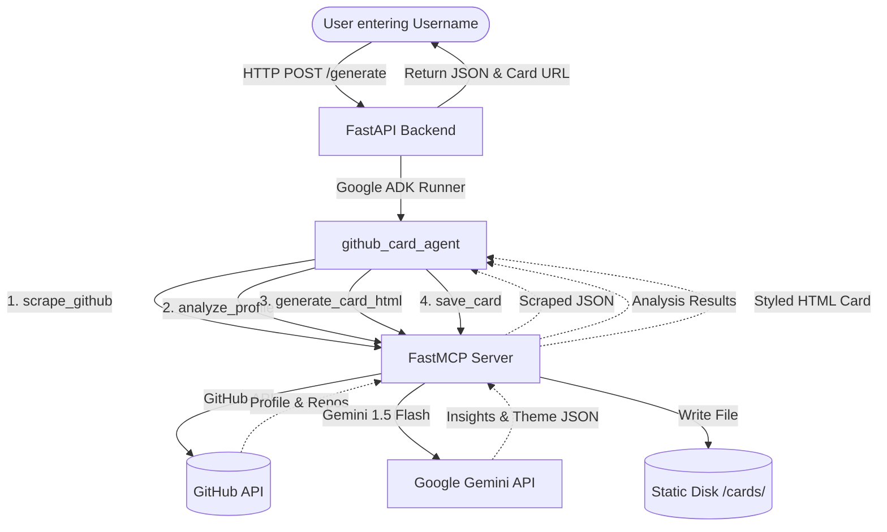

# 🐙 GitHub Dev Card Generator

[](https://fastapi.tiangolo.com)
[](https://deepmind.google/technologies/gemini/)
[](https://cloud.google.com/run)
[](https://www.docker.com)

An AI-powered developer profile analyzer and custom developer card generator. Built with **Google's Agent Development Kit (ADK)**, **Gemini 1.5 Flash**, **FastMCP**, and **FastAPI**, this application fetches public GitHub information, analyzes developer metrics, generates a customized persona card, and serves it through a sleek, modern UI.

---

## 🌐 Live Demo

You can access the live application here:
- **Frontend UI**: [https://github-card-frontend-1009339555607.us-central1.run.app](https://github-card-frontend-1009339555607.us-central1.run.app)
- **Backend API**: [https://github-card-backend-1009339555607.us-central1.run.app](https://github-card-backend-1009339555607.us-central1.run.app)

---

## ✨ Features

- **⚡ Instant Profile Scraping**: Leverages the GitHub REST API to securely fetch developer profiles and top-starred repositories.
- **🧠 Gemini-Powered Analysis**: Utilizes **Gemini 1.5 Flash** (via `gemini-flash-latest`) to extract developer insights, define custom skills, and generate a personalized persona.
- **🎨 Dynamic Persona Themes**: Automatically categorizes developers into visual themes like Hacker, Builder, Researcher, and more.
- **🖥️ Premium Frontend UI**: immersive dark mode dashboard with skeleton loading animations and responsive previewing.
- **🐳 Cloud-Ready**: Fully containerized with Docker and optimized for deployment on **Google Cloud Run**.

---

## 🏗️ Architecture Flow



---

## 🚀 Getting Started

### 💻 Local Development

1. **Configure Environment Variables**:
   Copy `.env.example` to `.env` and add your keys:
   ```env
   GOOGLE_API_KEY=your_gemini_api_key_here
   GITHUB_TOKEN=your_github_token_here
   ```

2. **Run with Docker Compose**:
   ```bash
   docker-compose up --build
   ```
   - Frontend: `http://localhost:3000`
   - Backend: `http://localhost:8080`

### ☁️ Deployment

The project is pre-configured for Google Cloud Run. Use the provided Dockerfiles for automated builds and deployments.
